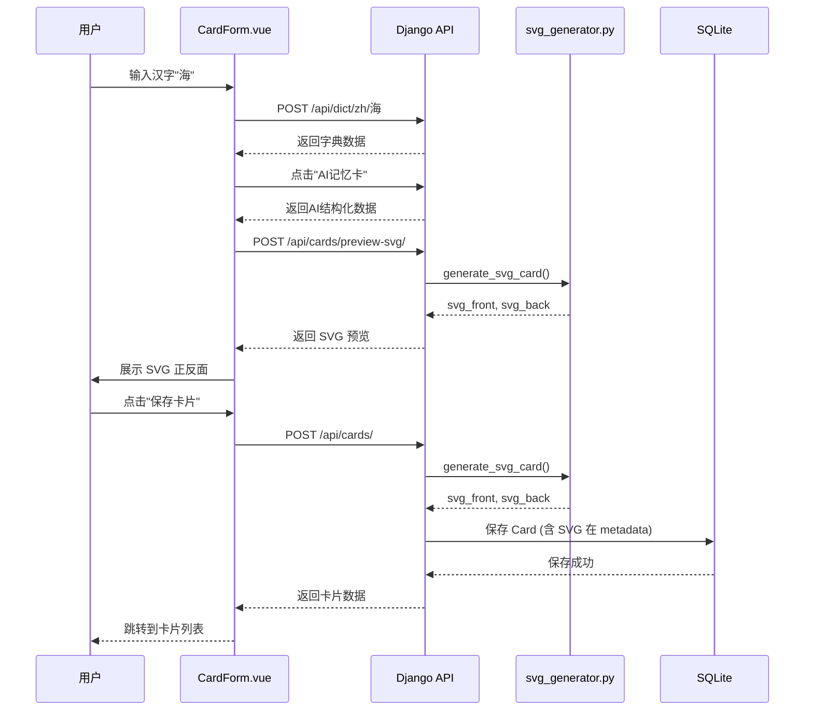
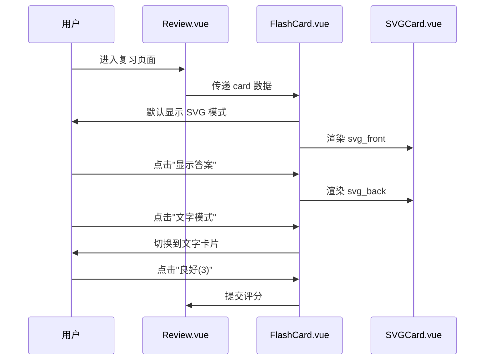

# SVG 卡片集成方案

## 项目背景
将 `svg.html` 中精美的双面卡片设计集成到 autoR 系统中,在添加卡片时自动生成 SVG,在复习时展示可视化卡片。

## 目标
1. ✅ 卡片添加时自动生成 SVG 正反面
2. ✅ 复习时展示 SVG 卡片(可切换文字/SVG 模式)
3. ✅ 保留 svg.html 的所有设计元素
4. ✅ 支持英语和汉字两种类型

## 非目标
- ❌ SVG 动画效果
- ❌ 卡片自定义主题
- ❌ 独立 SVG 文件导出

## 技术方案

### 1. 数据模型设计

**Card.metadata 新增字段**:
```json
{
  "svg_front": "<svg>...</svg>",
  "svg_back": "<svg>...</svg>",
  "svg_generated_at": "2025-01-26T10:30:00Z",
  "svg_version": "v1"
}
```

**优势**: 无需数据库 Migration,直接使用现有 JSONField。

### 2. 后端实现

#### 2.1 SVG 模板生成器
**文件**: `backend/cards/services/svg_generator.py`

**核心功能**:
- `generate_svg_card(word, card_type, metadata) -> (svg_front, svg_back)`
- 支持汉字和英语两种模板
- 基于 svg.html 的设计,使用 Python f-string 动态生成

**关键数据映射**:
```python
# 汉字 SVG 需要的数据
{
  'word': '海',
  'pinyin': 'hǎi',
  'tone': '第三声',
  'meanings': ['大洋、海洋', '形容巨大的、众多的'],
  'radical': '氵',
  'strokes': '11',
  'structure': '左右',
  'high_freq_words': ['大海', '海洋', '海边', '上海'],
  'example_sentence': '我们暑假去海边玩...',
  'memory_tip': '"每天都有水的地方就是大海。"',
  'confusion': [
    '海 (氵)：与水有关 → 海洋',
    '每 (母)：每天、每个',
    '悔 (忄)：心里难受 → 后悔'
  ]
}
```

**模板结构**:
- 正面(识记): 汉字、拼音、核心意思、部首笔画
- 反面(应用): 高频词组、例句、记忆法、近形字辨析

#### 2.2 API 集成
**修改**: `cards/serializers.py` (CardSerializer)
- 在 `create()` 和 `update()` 方法中调用 `svg_generator.generate_svg_card()`
- 自动将生成的 SVG 存入 `metadata`

### 3. 前端实现

#### 3.1 SVGCard 组件
**新建**: `frontend/src/components/SVGCard.vue`

**功能**:
- 接收 `svgContent` prop (字符串)
- 使用 `v-html` 安全渲染 SVG
- 支持响应式缩放(800x500 → 适应屏幕)

**Props**:
```javascript
{
  svgContent: String,  // SVG 完整代码
  width: Number,       // 默认 800
  height: Number       // 默认 500
}
```

#### 3.2 FlashCard 集成
**修改**: `frontend/src/components/FlashCard.vue`

**新增切换按钮**:
```vue
<div class="flex gap-2 mb-4">
  <button @click="viewMode = 'svg'" :class="viewMode === 'svg' ? 'active' : ''">
    🎨 SVG 卡片
  </button>
  <button @click="viewMode = 'text'" :class="viewMode === 'text' ? 'active' : ''">
    📄 文字模式
  </button>
</div>
```

**渲染逻辑**:
- `viewMode === 'svg'`: 显示 `<SVGCard :svgContent="card.metadata.svg_front" />`
- `viewMode === 'text'`: 显示当前的文字卡片(保持向后兼容)

#### 3.3 CardForm 集成
**修改**: `frontend/src/views/CardForm.vue`

**在 AI 生成后自动生成 SVG 预览**:
```javascript
async function generateAIMemoryCard() {
  // ... 现有 AI 生成逻辑 ...

  // 新增: 请求后端生成 SVG 预览
  const svgResponse = await axios.post('/api/cards/preview-svg/', {
    word: form.word,
    card_type: 'zh',
    metadata: form.metadata
  })

  svgPreview.value = {
    front: svgResponse.data.svg_front,
    back: svgResponse.data.svg_back
  }
}
```

**预览区域**:
```vue
<div v-if="svgPreview" class="mt-6 border rounded-lg p-4">
  <h3 class="font-semibold mb-2">📋 SVG 卡片预览</h3>
  <div class="grid grid-cols-2 gap-4">
    <SVGCard :svgContent="svgPreview.front" title="正面" />
    <SVGCard :svgContent="svgPreview.back" title="反面" />
  </div>
</div>
```

### 4. API 端点设计

#### 新增端点
**URL**: `POST /api/cards/preview-svg/`

**请求体**:
```json
{
  "word": "海",
  "card_type": "zh",
  "metadata": {
    "pinyin": ["hǎi"],
    "meaning_zh": "大洋、海洋",
    "radical": "氵",
    "strokes": "11"
  }
}
```

**响应**:
```json
{
  "svg_front": "<svg>...</svg>",
  "svg_back": "<svg>...</svg>"
}
```

**用途**: 在保存卡片前预览 SVG 效果。

## 实施步骤

### ✅ 阶段 0: 方案设计与评审
- [x] 分析 svg.html 结构
- [x] 编写详细方案文档
- [ ] 用户评审方案(待确认)

### 阶段 1: 后端 SVG 生成器 (2-3小时)
- [ ] 1.1 创建 `backend/cards/services/svg_generator.py`
- [ ] 1.2 实现汉字 SVG 模板函数 `generate_chinese_svg()`
- [ ] 1.3 实现英语 SVG 模板函数 `generate_english_svg()`
- [ ] 1.4 编写单元测试 `backend/cards/test_svg_generator.py`

### 阶段 2: API 集成 (1小时)
- [ ] 2.1 在 `CardSerializer` 中集成 SVG 生成逻辑
- [ ] 2.2 新增 `preview-svg` API 端点(ViewSet action)
- [ ] 2.3 测试 API 响应正确性

### 阶段 3: 前端组件开发 (2-3小时)
- [ ] 3.1 创建 `frontend/src/components/SVGCard.vue` 组件
- [ ] 3.2 在 `FlashCard.vue` 中添加 SVG/文字切换功能
- [ ] 3.3 在 `CardForm.vue` 中添加 SVG 预览
- [ ] 3.4 调整样式和响应式布局

### 阶段 4: 集成测试 (1-2小时)
- [ ] 4.1 端到端测试: 添加卡片 → 生成 SVG → 复习展示
- [ ] 4.2 测试不同数据完整度的卡片(缺少部首、例句等)
- [ ] 4.3 测试英语和汉字两种类型
- [ ] 4.4 修复发现的 bug

### 阶段 5: 文档更新
- [ ] 5.1 更新 `PROJECTWIKI.md` - 新增 SVG 模块说明
- [ ] 5.2 更新 `CHANGELOG.md` - 记录新功能
- [ ] 5.3 更新 `CLAUDE.md` - 添加 SVG 相关开发指南

## 数据流图



## 复习流程



## 技术债务与风险

### 风险
1. **SVG 文件大小**: 每张卡片约 5-8KB,1000 张卡片 = 5-8MB
   - 缓解: 使用 gzip 压缩,实际存储约 1-2MB

2. **浏览器兼容性**: 老旧浏览器可能不支持内联 SVG
   - 缓解: 检测浏览器,不支持时自动降级到文字模式

3. **SVG 模板维护**: 未来修改设计需要同步更新模板代码
   - 缓解: 使用版本号 `svg_version`,支持渐进式升级

### 技术债务
- 当前使用字符串模板,未来可考虑使用 Jinja2 或专业 SVG 库
- SVG 未做客户端缓存,每次都从 metadata 读取

## 测试覆盖率目标

默认目标: **85%**

### 后端测试
- `test_svg_generator.py`: 测试各种数据组合生成正确 SVG
- `test_card_api.py`: 测试 API 返回包含 SVG 字段

### 前端测试
- `SVGCard.spec.js`: 测试组件渲染
- `FlashCard.spec.js`: 测试 SVG/文字模式切换

## 回滚策略

如果 SVG 功能出现问题:
1. **立即**: 在 FlashCard 中默认切换到文字模式
2. **数据安全**: SVG 数据在 metadata 中,删除该字段不影响核心数据
3. **代码回滚**: Git revert 到引入 SVG 之前的提交

## ADR (架构决策记录)

### 决策 1: SVG 存储在 metadata 而非单独字段
**理由**:
- 避免数据库 schema 变更
- SVG 属于卡片的"可选元数据",不影响核心功能
- 方便未来扩展其他格式(如 PDF)

### 决策 2: 后端生成 SVG 而非前端
**理由**:
- 减轻前端性能负担
- 便于服务端渲染(SSR)和 API 导出
- 统一模板管理,避免前后端不一致

### 决策 3: 提供 SVG/文字双模式
**理由**:
- 保持向后兼容(已有用户习惯文字卡片)
- 适应不同使用场景(移动端可能偏好文字)
- 降低技术风险(SVG 渲染失败时有备用方案)

## 成功指标

- [ ] 添加汉字卡片时,自动生成 SVG 正反面
- [ ] 复习时可切换 SVG/文字模式
- [ ] SVG 卡片包含 svg.html 的所有设计元素
- [ ] 测试覆盖率 ≥ 85%
- [ ] 无严重性能问题(复习页面加载 < 1s)

---

**最后更新**: 2025-01-26
**负责人**: AI Assistant + User
**预计工期**: 6-9 小时
